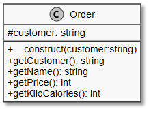

# 8.2 Das Burger-Restaurant

Die Software, die im folgenden Kapitel erstellt wird, abstrahiert die Bestellung, die Erstellung und das Ausgeben von Essen in einem sich entwickelnden **Burger-Restaurant**. Dazu müssen wir den Code immer wieder an neue Gegebenheiten und Veränderungen anpassen, die sich während der Entwicklung des Restaurants ergeben.

Im ersten Schritt ist unser Restaurant, genannt Mega-Burger, noch ein kleiner Foodtruck, und wir bieten einen einfachen Burger bestehend aus einer festen Anzahl von Zutaten zu einem fixen Preis an. In diesem Foodtruck gibt es nur einen Beef-Burger. Gebraten werden die Bratlinge in einer Pfanne. Die Bestellung braucht eine feste Zeit für die Zubereitung. Versuchen wir, dieses zu abstrahieren und zu modellieren.

**Der erste Entwurf der Software**<br>
Eine Bestellung ist immer ein Burger für einen Kunden zu einem Preis mit einer Zubereitungszeit. Da aber nur das Attribut Kunde (Customer) veränderlich ist, brauchen wir auch nur dieses zu modellieren. Die anderen Werte können über die Methoden der Klasse bereitgestellt werden.

**Klasse "Order"**<br>
Eine Bestellung hat immer einen Kunden.


Das Klassendiagramm lässt sich wie folgt darstellen.



??? example "Die Klassen des Klassendiagramms (aufklappen)"
    Wie Sie leicht sehen können, handelt es sich um eine sehr einfache Klasse. 
    
    ```php linenums="1"

    <?php
    declare(strict_types=1);

    class Order
    {
        protected $customer;

        public function __construct(string $customer)
        {
            $this->customer = $customer;
        }

        public function getCustomer(): string
        {
            return $this->customer;
        }

        public function getName(): string
        {
            return 'Beef-Burger';
        }

        public function getPrice(): int
        {
            return 850; // Preis in Cent
        }

        public function getPreparationTime(): int
        {
            return 300; // Zeit in Sekunden
        }

        public function getKiloCalories(): int
        {
            return 550; // kcal
        }
    }
    ```

**Hauptprogramm**<br>
Unsere Software besteht aus einem simplen Bestell-Formular, in welches man in diesem Fall nur seinen Namen eintragen kann. Daraufhin bekommt man eine Ausgabeseite mit den Daten. Die Daten werden durch die Methoden in unserer Klasse `Order` bereitgestellt.

Im Hauptprogramm erstellen wir die drei Funktionen `createOrder()`, `printOrderSummary()` und `printOrderForm()`, die in einer einfachen if-Anweisung aufgerufen werden. Hinweis: Es sind reine Funktionen im Hauptprogramm und keine Methoden!

```php linenums="1"
<?php
if (!empty($_GET['customer'])) {
    $order = createOrder($_GET['customer']);
    printOrderSummary($order);
} else {
    printOrderForm();
}
```

Die erste Funktion `createOrder()` erstellt uns eine neue Bestellung für den Kunden. Hier wird ein Objekt der Klasse `Order` erstellt und mit `return` zurückgegeben.

```php linenums="1"
<?php
function createOrder(string $customer): Order
{
    return new Order($customer);
}
```

Die zweite Funktion `printOrderSummary()` zeigt eine Zusammenfassung der Bestellung. Hier werden die einzelnen Methoden des Objekts `Order` aufgerufen.

```php linenums="1"
<?php
function printOrderSummary(Order $order)
{
    $orderFinishTime = getOrderFinishTime($order->getPreparationTime());
    $price = number_format($order->getPrice() / 100, 2);

    echo <<<HTML
    <p>Thank you {$order->getCustomer()}.</p>
    <p>Your {$order->getName()} will be ready at {$orderFinishTime}.</p>
    <p>It has {$order->getKiloCalories()} kcal.</p>
    <p>Please pay {$price} €.</p>
    <a href="index.php">Another Order</a>
    HTML;
}
```

Die dritte Funktion `printOrderForm()` gibt das Eingabe-Formular aus.

```php linenums="1"
<?php
function printOrderForm()
{
    echo <<<HTML
    <h1>Welcome to Mega-Burger</h1>
    <h2>Please enter your name for the order.</h2>
    <form method="get">
        <input type="text" name="customer" required/>
        <input type="submit" value="Order">
    </form>
    HTML;
}
```

Hier haben wir uns noch eine Hilfsfunktion `getOrderFinishTime()` angelegt, die den Zeitstempel formatiert. Diese Funktion berechnet die Fertigstellungszeit des Bestellung basierend auf der Zubereitungszeit und gibt diese formatiert zurück.

```php linenums="1"
<?php
function getOrderFinishTime(int $preparationTime)
{
    $time = time() + $preparationTime;
    $date = new DateTime();
    $date->setTimestamp($time);
    $date->setTimezone(new DateTimeZone('Europe/Berlin'));
    return $date->format('H:i:s');
}
```

Im Falle eines noch nicht gesetzten Kundennamens wird der `else`-Block im Hauptprogramm (siehe oben) durchlaufen und die Funktion `printOrderForm()` aufgerufen, die das Eingabe-Formular ausgibt. Dieses Formular erlaubt dem Nutzer, seinen Namen einzugeben, welcher dann zur Erstellung der Bestellung verwendet wird.


```php linenums="1"
<?php
function printOrderForm()
{
    echo <<<HTML
    <h1>Welcome to Mega-Burger</h1>
    <h2>Please enter your name for the order.</h2>
    <form method="get">
        <input type="text" name="customer" required/>
        <input type="submit" value="Order">
    </form>
    HTML;
}
```

Somit haben wir ein ganz einfaches Formular mit einer ganz einfachen Ausgabe. Hier haben wir noch keine Pattern benutzt.

!!! tip "Tipp"
    Achten Sie darauf, den HTML-Code korrekt zu schließen und sicherzustellen, dass alle Formular-Inputs korrekt validiert werden, bevor sie verarbeitet werden. Dies verhindert häufige Fehler und verbessert die Sicherheit der Anwendung.


!!! question "Aufgabe"
    Laden Sie nun den Sourcecode herunter und bringen Sie das Formular auf Ihrem Server zum Laufen ([Download Sourcecode](./media/9-2BurgerRestaurant.zip)). Auch wenn der Sourcecode hier noch überschaubar ist, sollten Sie dies unbedingt machen. Es wird gleich mit jedem Pattern schwieriger. Wenn der Anfang nicht läuft oder Sie diesen Anfang nicht verstehen, haben Sie gleich keine Chance mehr, dem Kapitel zu folgen.

    

    In der ZIP-Datei [9-2BurgerRestaurant.zip](./media/9-2BurgerRestaurant.zip) befinden sich die *index.php* (= Hauptprogramm) und im **Ordner src befinden sich die Klassen**. Hier ist es nur die Klasse order in der Datei *order.php*. Zusätzlich gibt es noch einen **Ordner 0-framework** mit den Dateien *footer.php* und *header.php*. Diese beiden Dateien enthalten die Einbindung des HTML-Frameworks Bootstrap und etwas HTML, damit das Formularseite und die Ergebnisseite etwas schöner aussehen.

    Screenshot der Formularseite.  

    


Mit jedem neuen Unterkapitel werden wir das Design weiter verfeinern und zusätzliche Patterns einführen, die  helfen, den Code besser strukturierbar und wartbarer zu machen. Beginnen Sie immer mit dem Testen der grundlegenden Funktionalitäten, bevor Sie komplexere Logiken hinzufügen.

Vergessen Sie nicht, Ihre Fortschritte regelmäßig zu sichern und Backup-Kopien Ihrer Arbeit zu erstellen. Es ist wichtig, dass Sie bei einem Fehler schnell auf eine funktionierende Version Ihrer Anwendung zurückgreifen können.

**Fazit**<br>
Das Burger-Restaurant Beispiel bietet einen praktischen Einstieg in die Nutzung von Entwurfsmustern in der Softwareentwicklung. Durch das schrittweise Erweitern der Anwendung können tiefe Einblicke in die Strukturierung und Organisation von Code erhalten werden. Nutzen Sie diese Gelegenheit, um Ihre Fähigkeiten in der PHP-Programmierung und im Umgang mit komplexen Softwaresystemen zu verbessern.

Viel Erfolg beim Programmieren und Experimentieren mit Ihrem eigenen Burger-Restaurant!
