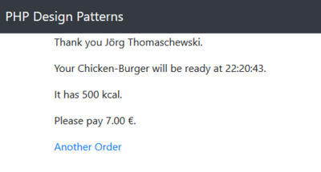

# 8.3 Template Pattern (dt. Schablone)

Das **Verhaltensmuster Template (dt. Schablone)** dient dazu, gemeinsame, meist abstrakte Methoden für Subklassen bereitzustellen. Anders ausgedrückt: Wir stellen das Skelett (oder besser Template) des Programmablaufs bereit und delegieren Arbeitsschritte an die Tochterklassen. Dazu erstellt man eine abstrakte Klasse mit abstrakten Methoden. Diese werden dann in den konkreten Klassen implementiert.

**Veränderte Anforderungen**<br>
Das Restaurant soll ab sofort mehr Auswahl anbieten und erweitert das Menü auf verschiedene Burger. Den Beef-Burger, den Chicken-Burger und den Vegan-Burger. Dazu müssen wir nun neben dem Namen des Kunden auch den bestellten Burger bei der Bestellung aufnehmen.

**Der überarbeitete Entwurf der Software**<br>
Anstelle nur einer Klasse verwenden wir nun für die Beef-Burger, Chicken-Burger und Vegan-Burger jeweils eine eigene Klasse. Damit auch alle Klassen wirklich die gleiche Struktur haben, verwenden wir eine gemeinsame abstrakte Klasse `OrderTemplate`.


Wir können im Template die Erfassung des Kunden bereits vollständig implementieren, da dieses für alle Burger gleich ist.

```php linenums="1"
abstract class OrderTemplate
{
    protected $customer;

    public function __construct(string $customer)
    {
        $this->customer = $customer;
    }

    public function getCustomer(): string
    {
        return $this->customer;
    }
}
```

Die Methoden für den Namen, den Preis und die Energie in KiloKalorien definieren wir als abstrakte Methoden, sodass sie in den Bestellungsklassen konkretisiert werden müssen.

```php linenums="1"
    abstract public function getName(): string;
    abstract public function getPrice(): int;
    abstract public function getPreparationTime(): int;
    abstract public function getKiloCalories(): int;
```


Die Klassen sind noch immer recht einfach.

??? example "Sourcecode Ordertemplate (aufklappen)"
    ```php linenums="1"
    <?php declare(strict_types = 1);
    /**
     * A template for a burger order
     * @author Thorsten 'stepo' Hallwas
     */

    abstract class OrderTemplate
    {
        protected $customer;

        public function __construct(string $customer)
        {
            $this->customer = $customer;
        }

        public function getCustomer(): string
        {
            return $this->customer;
        }

        abstract public function getName(): string;
        abstract public function getPrice(): int;
        abstract public function getPreparationTime(): int;
        abstract public function getKiloCalories(): int;
    }
    ```

??? example "Sourcecode BeefBurgerOrder (aufklappen)"
    ```php linenums="1"
    <?php declare(strict_types = 1);
    /**
     * Representation of a beef-burger order in a burger restaurant.
     * @author Thorsten 'stepo' Hallwas
     */

    class BeefBurgerOrder extends OrderTemplate
    {

        public function getName(): string
        {
            return 'Beef-Burger';
        }

        public function getPrice(): int
        {
            return 850;
        }

        public function getPreparationTime(): int
        {
            return 300;
        }

        public function getKiloCalories(): int
        {
            return 550;
        }
    }
    ```
??? example "Sourcecode ChickenBurgerOrder (aufklappen)"
    ```php linenums="1"
    <?php declare(strict_types = 1);
    /**
     * Representation of a chicken burger order in a burger restaurant.
     * @author Thorsten 'stepo' Hallwas
     */

    class ChickenBurgerOrder extends OrderTemplate
    {

        public function getName(): string
        {
            return 'Chicken-Burger';
        }

        public function getPrice(): int
        {
            return 700;
        }

        public function getPreparationTime(): int
        {
            return 200;
        }

        public function getKiloCalories(): int
        {
            return 500;
        }

    }
    ```

??? example "Sourcecode VeganBurgerOrder (aufklappen)"
    ```php linenums="1"
    <?php declare(strict_types = 1);
    /**
     * Representation of a vegan-burger order in a burger restaurant.
     * @author Thorsten 'stepo' Hallwas
     */

    class VeganBurgerOrder extends OrderTemplate
    {

        public function getName(): string
        {
            return 'Vegan-Burger';
        }

        public function getPrice(): int
        {
            return 750;
        }

        public function getPreparationTime(): int
        {
            return 150;
        }

        public function getKiloCalories(): int
        {
            return 450;
        }

    }
    ```

**Anpassung des Hauptprogramms**<br>
Unsere Software wird nun um eine Auswahl im Formular ergänzt und eine Switch-Anweisung in der Funktion `createOrder`, die je nach Auswahl die richtige Klasse instantiiert. Der Ausgabeteil bleibt unverändert, wir müssen nur den Typ der entgegengenommenen Klasse anpassen.

```php linenums="1"
function getOrder(string $customer, string $burger): OrderTemplate
{
    switch ($burger) {
        case 'beef':
            return new BeefBurgerOrder($customer);
        case 'chicken':
            return new ChickenBurgerOrder($customer);
        default:
            return new VeganBurgerOrder($customer);
    }
}
```

!!! question "Aufgabe"
    Laden Sie nun den Sourcecode herunter und bringen Sie das Formular auf Ihrem Server zum Laufen ([Download Sourcecode](./media/9-3BurgerRestaurant.zip)). 

    Screenshot der Formularseite.

    

    Screenshot der Ergebnisseite.

    
