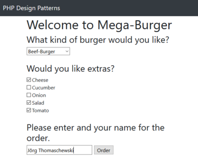

# 8.4 Decorator Pattern (dt. Dekorierer)

Das **Decorator Pattern (dt. Dekorierer)** gehört zur Gruppe der **Strukturmuster** und kann eingesetzt werden, um komplizierte Vererbungshierarchien zu umgehen, die durch die Kombination von Eigenschaften entstehen würden.

**Veränderte Anforderungen**<br>
Unser Restaurant erlaubt ab sofort das Hinzufügen von Zutaten (z.B. Käse) zum Burger. Dadurch ergeben sich nach den drei bereits existierenden Burgern bei der Zutat "Käse" weitere drei Möglichkeiten einer Bestellung.

**Wie man die Software <u>nicht</u> überarbeiten sollte!**<br>
Um die drei neuen Möglichkeiten mit Käse abzubilden, könnten wir drei weitere Klassen hinzufügen. Ohne das Decorator Pattern würde sich nun folgendes Klassendiagramm ergeben.

Zutat Käse als Kindklasse. So sollte es nicht sein!


Anschließend schauen wir uns die Umsetzung der Bestellmöglichkeiten mit Gurke an. Auch hier könnte der Ansatz sein, eine Vererbungshierarchie mit allen Möglichkeiten erstellt wird. Allerdings wächst die Anzahl der Klassen nur für die neue Option durch die gegebenen Bestellungsmöglichkeiten mit Gurken bereits auf 12 an und mit jeder neuen Option verdoppelt sich die Anzahl erneut. Da dieser Klassenbaum und die Menge der Dateien zu schnell anwächst, brauchen wir eine andere Lösung, den Dekorierer.

**Der überarbeitete Entwurf der Software**<br>
Der bessere Ansatz zur Lösung des Problems ist das **Decorator Pattern (dt. Dekorierer)**. Zunächst nehmen wir wieder eine abstrakte Klasse (hier **AbstractOrderDecorator**) und in den Kindklassen definieren wir jeweils eine konkrete Zutat, z.B. Käse in der Klasse **CheeseDekorator**. Somit können später weitere Zutaten einfach hinzugefügt werden.


Wir haben somit einerseits die [verschiedenen Burger](./media/Template_Pattern_dt_Schablone.md) und andererseits nun verschiedenen Zutaten. Nun kommt der Trick und wir müssen das Klassendiagramm mit den Zutaten mit dem Klassendiagramm für die verschiedenen Burger miteinander verbinden. Diese Verbindung gelingt uns mit einem **Interface**, das wir oberhalb der abstrakten Klassen verwenden.

**Umsetzung in der Software**<br>
Um das Decorator-Klassendiagramm übersichtlich darzustellen, nehmen wir nun exemplarisch nur den **Beef-Burger** und als Zutat nur **Cheese**.

Klassendiagramm Decorator Pattern mit der Klasse 'OrderInterface' als verbindendes Element zwischen den Zutaten (links) und den Burgern (rechts)


Auf der rechten Seite im Klassendiagramm sehen wir unser **OrderTemplate** und die Kindklasse **BeefBurgerOrder**. Auf die Klassen **VeganBurgerOrder** und **ChickenBurgerOrder** wurde hier in der Darstellung verzichtet. Diese sind natürlich auch Kindklassen von **OrderTemplate**, so wie wir dies im letzten Unterkapitel [Template Pattern](./media/Template_Pattern_dt_Schablone.md) gezeigt hatten.

Auf der linken Seite im Klassendiagramm sehen wir unsere Klasse **AbstractOrderDecorator** und darunter können alle Zutaten aufgeführt werden.

Die Verbindung der beiden Seiten "Zutaten" und "Burger" erfolgt über das OrderInterface. Dieses OrderInterface hat noch eine Besonderheit: eine Aggregation und Komposition zwischen OrderInterface und AbstractOrderDecorator. Damit werden dem Burger die Zutaten übermittelt.


Und so sieht der wichtige Teil des Sourcecodes für die Klasse **AbstractOrderDecorator** aus. Die Klasse **AbstractOrderDecorator** nimmt eine Instanz des Orderinterface im Konstruktor entgegen und hat damit alle Daten des Burger (Beef-Burger, Chicken-Burger oder Vegan-Burger) und kann die Daten der Zutaten hinzufügen.

```php linenums="1"
abstract class AbstractOrderDecorator implements OrderInterface
{
    protected $order;

    public function __construct(OrderInterface $order)
    {
        $this->order = $order;
    }

    public function getCustomer(): string
    {
        return $this->order->getCustomer();
    }

        public function getName(): string
    {
        return $this->order->getName();
    }
    ...
```


Das Hinzufügen ist im Ausschnitt der Klasse **CheeseDecorator** sehr gut zu erkennen.
```php linenums="1"
class CheeseDecorator extends AbstractOrderDecorator
{

    public function getName(): string
    {
        return $this->order->getName().' with cheese';
    }
    ...
```
Der Name des Burger (z.B. Beef-Burger) wird ausgelesen und um den Text *with cheese* (**s. Zeile 6)** ergänzt. Auch die "PreparationTime", "Price" und "KiloCalories" werden entsprechend ergänzt. 

### Klassen für die Burger
Die Klassen für die Burger wurden nicht geändert. Nur bei der Klasse *OrderTemplate* wurde *implements OrderInterface* zusätzlich angegeben.

??? example "Sourcecode Ordertemplate (aufklappen)"
    ```php linenums="1"
    <?php declare(strict_types = 1);
    /**
     * A template for a burger order
     * @author Thorsten 'stepo' Hallwas
     */

    abstract class OrderTemplate implements OrderInterface
    {
        protected $customer;

        public function __construct(string $customer)
        {
            $this->customer = $customer;
        }

        public function getCustomer(): string
        {
            return $this->customer;
        }

        abstract public function getName(): string;
        abstract public function getPrice(): int;
        abstract public function getPreparationTime(): int;
        abstract public function getKiloCalories(): int;
    }
    ```

??? example "Sourcecode BeefBurgerOrder (aufklappen)"
    ```php linenums="1"
    <?php declare(strict_types = 1);
    /**
     * Representation of a beef-burger order in a burger restaurant.
     * @author Thorsten 'stepo' Hallwas
     */

    class BeefBurgerOrder extends OrderTemplate
    {

        public function getName(): string
        {
            return 'Beef-Burger';
        }

        public function getPrice(): int
        {
            return 850;
        }

        public function getPreparationTime(): int
        {
            return 300;
        }

        public function getKiloCalories(): int
        {
            return 550;
        }
    }
    ```

??? example "Sourcecode ChickenBurgerOrder (aufklappen)"
    ```php linenums="1"
    <?php declare(strict_types = 1);
    /**
     * Representation of a chicken burger order in a burger restaurant.
     * @author Thorsten 'stepo' Hallwas
     */

    class ChickenBurgerOrder extends OrderTemplate
    {

        public function getName(): string
        {
            return 'Chicken-Burger';
        }

        public function getPrice(): int
        {
            return 700;
        }

        public function getPreparationTime(): int
        {
            return 200;
        }

        public function getKiloCalories(): int
        {
            return 500;
        }

    }
    ```

??? example "Sourcecode VeganBurgerOrder (aufklappen)"
    ```php linenums="1"
    <?php declare(strict_types = 1);
    /**
     * Representation of a vegan-burger order in a burger restaurant.
     * @author Thorsten 'stepo' Hallwas
     */

    class VeganBurgerOrder extends OrderTemplate
    {

        public function getName(): string
        {
            return 'Vegan-Burger';
        }

        public function getPrice(): int
        {
            return 750;
        }

        public function getPreparationTime(): int
        {
            return 150;
        }

        public function getKiloCalories(): int
        {
            return 450;
        }

    }
    ```

### Klassen des Decorators
Die Klassen des Decorators für die Zutaten sind auch nicht sonderlich spannend. Sie ergänzen nur die Angaben der Burger. Unser konkreter *CheeseDecorator* überschreibt die Funktionen *getName*, *getPreparationTime* und *getPrice* und fügt jeweils Käse dem Namen, 30 Sekunden für das Schmelzen des Käses auf den Bratling, 89 kCal und 50 Cent dem Preis hinzu.


??? example "Sourcecode AbstractOrderDecorator (aufklappen)"
    ```php linenums="1"
    <?php declare(strict_types = 1);
    /**
     * Decorator for orders in our burger-restaurant.
     * @author Thorsten 'stepo' Hallwas
     */

    abstract class AbstractOrderDecorator implements OrderInterface
    {

        protected $order;

        public function __construct(OrderInterface $order)
        {
            $this->order = $order;
        }

        public function getCustomer(): string
        {
            return $this->order->getCustomer();
        }

        public function getName(): string
        {
            return $this->order->getName();
        }

        public function getPrice(): int
        {
            return $this->order->getPrice();
        }

        public function getPreparationTime(): int
        {
            return $this->order->getPreparationTime();
        }

        public function getKiloCalories(): int
        {
            return $this->order->getKiloCalories();
        }
    }
    ```

??? example "Sourcecode CheeseDecorator (aufklappen)"
    ```php linenums="1"
    <?php declare(strict_types = 1);
    /**
     * Decorator to add cheese to to a burger order.
     * @author Thorsten 'stepo' Hallwas
     */

    class CheeseDecorator extends AbstractOrderDecorator
    {
        public function getName(): string
        {
            return $this->order->getName().' with cheese';
        }

        public function getPreparationTime(): int
        {
            return $this->order->getPreparationTime() + 30;
        }

        public function getPrice(): int
        {
            return $this->order->getPrice() + 50;
        }

        public function getKiloCalories(): int
        {
            return $this->order->getKiloCalories() + 89;
        }
    }
    ```

??? example "Sourcecode CucumberDecorator (aufklappen)"
    ```php linenums="1"
    <?php declare(strict_types = 1);
    /**
     * Decorator to add a slice of cucumber to a burger order.
     * @author Thorsten 'stepo' Hallwas
     */

    class CucumberDecorator extends AbstractOrderDecorator
    {
        public function getName(): string
        {
            return $this->order->getName().' with cucumber';
        }

        public function getPreparationTime(): int
        {
            return $this->order->getPreparationTime() + 5;
        }

        public function getKiloCalories(): int
        {
            return $this->order->getKiloCalories() + 3;
        }
    }
    ```

??? example "Sourcecode OnionDecorator (aufklappen)"
    ```php linenums="1"
    <?php declare(strict_types = 1);
    /**
     * Decorator to add onion to to a burger order.
     * @author Thorsten 'stepo' Hallwas
     */

    class OnionDecorator extends AbstractOrderDecorator
    {
        public function getName(): string
        {
            return $this->order->getName().' with onion';
        }

        public function getPreparationTime(): int
        {
            return $this->order->getPreparationTime() + 5;
        }

        public function getKiloCalories(): int
        {
            return $this->order->getKiloCalories() + 8;
        }
    }
    ```

??? example "Sourcecode SaladDecorator (aufklappen)"
    ```php linenums="1"
    <?php declare(strict_types = 1);
    /**
     * Decorator to add salad to burger orders.
     * @author Thorsten 'stepo' Hallwas
     */

    class SaladDecorator extends AbstractOrderDecorator
    {
        public function getName(): string
        {
            return $this->order->getName().' with salad';
        }

        public function getPreparationTime(): int
        {
            return $this->order->getPreparationTime() + 5;
        }

        public function getKiloCalories(): int
        {
            return $this->order->getKiloCalories() + 3;
        }
    }
    ```

??? example "Sourcecode TomatoDecorator (aufklappen)"
    ```php linenums="1"
    <?php declare(strict_types = 1);
    /**
     * Decorator to add a slice of tomato to burger orders.
     * @author Thorsten 'stepo' Hallwas
     */

    class TomatoDecorator extends AbstractOrderDecorator
    {
        public function getName(): string
        {
            return $this->order->getName().' with tomato';
        }

        public function getPreparationTime(): int
        {
            return $this->order->getPreparationTime() + 5;
        }

        public function getKiloCalories(): int
        {
            return $this->order->getKiloCalories() + 4;
        }
    }
    ```

### Anpassung *OrderInterface* 
Somit bleibt noch der Sourcecode für das Interface *OrderInterface* als Verbindung zwischen den Zutaten und den Burgern.

??? example "Sourcecode OrderInterface (aufklappen)"
    ```php linenums="1"
    <?php declare(strict_types = 1);
    /**
     * Interface for orders in our restaurant.
     */

    interface OrderInterface
    {
        public function getCustomer(): string;
        public function getName(): string;
        public function getPrice(): int;
        public function getPreparationTime(): int;
        public function getKiloCalories(): int;
    }
    ```


### Anpassung des Hauptprogramms
Unsere Software wird nun um eine weitere Auswahl im Formular ergänzt. Gleichzeitig wird die Rückgabe nun auf *OrderInterface* geändert. In der Funktion rufen wir in einer Schleife eine weitere Funktion auf, die die aktuelle Bestellung mit einem Extra dekoriert.

```php linenums="1"
function createOrder(string $customer, string $burger, ?array $extras): OrderInterface
{
    switch ($burger) {
        case 'beef':
            $order = new BeefBurgerOrder($customer);
            break;
        case 'chicken':
            $order = new ChickenBurgerOrder($customer);
            break;
        default:
            $order = new VeganBurgerOrder($customer);
    }
    if (is_array($extras)) {
        foreach ($extras as $extra) {
            $order = addExtraToOrder($extra, $order);
        }
    }

    return $order;
}

function addExtraToOrder(string $extraIdentifier, OrderInterface $order): OrderInterface
{
    switch ($extraIdentifier) {
        case 'cheese':
            return new CheeseDecorator($order);
        case 'cucumber':
            return new CucumberDecorator($order);
        case 'onion':
            return new OnionDecorator($order);
        case 'salad':
            return new SaladDecorator($order);
        case 'tomato':
            return new TomatoDecorator($order);
        default:
            return $order;
    }
}
```

!!! question "Aufgabe"
    Laden Sie nun die Sourcecode herunter und bringen Sie das Formular auf ihrem Server zum Laufen ([Sourcecode  9-4BurgerRestaurant.zip](./media/9-4BurgerRestaurant.zip)). Wir haben nun so viele Klassen, dass wir mit [Autoloading (SPL)](../5OOP/5.5.3AutoloadingSPL.md) arbeiten. Daher ist ein "Hilfsordner *vendor*" hinzugekommen, sowie eine Datei *composer.json*. Für das Verständnis des Decorator Pattern brauchen Sie sich dies aber nicht genauer ansehen.

    Screenshot der Formularseite.<br>
    


    Screenshot der Ergebnisseite.<br>
    


!!! question "Aufgabe"
    Erstellen Sie einen Dekorierer, um Avocadoscheiben hinzuzufügen. Diese kosten einen Euro und verlängern die Zubereitungszeit um 10 Sekunden. Außerdem haben die Avocadoscheiben 15 kCal.


!!! question "Übung Profifragen"
    1. Warum ist es falsch im CheeseDecorator `parent::getPrice()` aufzurufen?
    2. Lassen sich weitere Teile des Burgers in Dekorierer umwandeln?

??? example "Lösung"
    1. Wichtig ist, dass die Rückgabe des aggregierten Objektes verwendet wird. Die Vererbung würde in diesem Fall die mögliche Kette von aufrufen unterbrechen.
    2. Für den flexibleren Verlauf des Restaurants macht es sogar viel Sinn. Hier wären mehrere Bratlinge, kein Brötchen und auch die Soßen als potentielle Dekorierer denkbar. Allerdings müssen wir darauf achten, dass die Bratlinge zubereitet werden müssen, während die Zutaten bereits vorbereitet worden sind.

