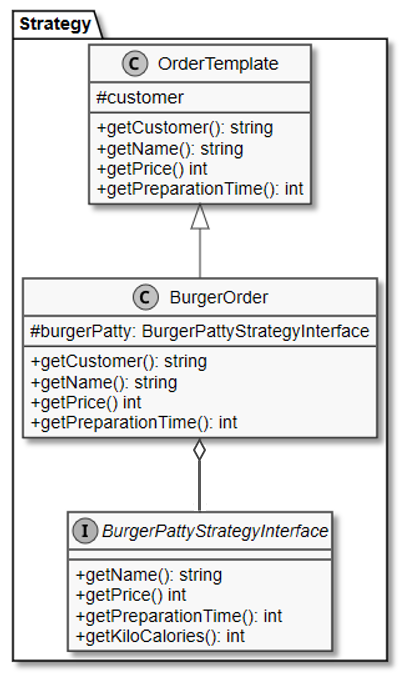
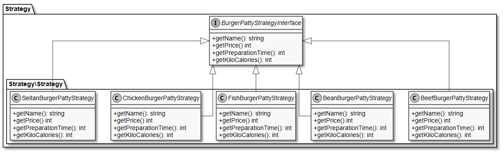
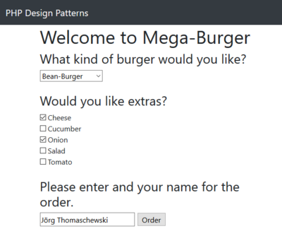
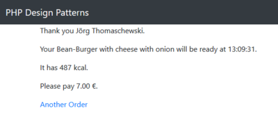

# 8.5 Strategy Pattern (dt. Strategie)

Das **Strategy Pattern (dt. Strategie)** definiert eine Familie von austauschbaren Algorithmen oder Klassen und gehört zur Gruppe der **Verhaltensmuster**. Im Gegensatz zum Dekorierer wird hier intern Funktionalität ausgetauscht.


**Veränderte Anforderungen**<br>
Unser Restaurant will noch flexibler werden und erlauben die Bratlinge zu bestimmen und darüber hinaus noch weitere anbieten. Da diese unterschiedliche Zubereitungszeit und Preise haben, wirkt sich dieses auch auf den Gesamtpreis aus.

Ab sofort können folgende Burger bestellt werden:

- Beef-Burger
- Chicken-Burger
- Fish-Burger
- Bean-Burger (Vegan)
- Seitan-Burger (Vegan)


**Der überarbeitete Entwurf der Software**<br>
Natürlich könnte man das bisherige Klassendiagramm leicht um weitere Burger ergänzen. Insofern ist es eigentlich nicht notwendig hier ein neues Pattern einzuführen. Und wir möchten es doch machen, um das Strategy Pattern zu zeigen.

Und wieder bauen wir eine Abstraktionsebene (also ein Interface) ein. Bisher hatten wir ein **OrderTemplate** und darunter die einzelnen Klassen für die Burger. Nun kommt wie bereits gesagt, eine weitere Ebene dazu. **OrderTemplate** hat jetzt keine konkreten Kindklassen mehr, sondern eine allgemeine Klasse **BurgerOrder**, die wiederum mit dem Interface **BurgerPattyStrategyInterface** verbunden ist.


**Klassendiagramm des Strategy Pattern**<br>


Durch das Interface können wir die Austauschbarkeit erreichen, da unsere Bestellung den gewünschten Bratling aufnehmen kann (Aggregation).

Und erst unterhalb des *BurgerPattyStrategyInterface* sind die Kindklassen mit den konkreten Burgern beziehungsweise der Bratlinge (Englisch: Patties) vorhanden.


**BurgerPattyStrategyInterface mit den zugehörigen Kindklassen**<br>


Schauen wir uns den (langweiligen) Sourcecode von **BurgerPattyStrategyInterface** an.

```php linenums="1"
interface BurgerPattyStrategyInterface
{
    public function getName(): string;
    public function getPrice(): int;
    public function getPreparationTime(): int;
    public function getKiloCalories(): int;
}
```

Diese Methodenköpfe sind in diesem Beispiel die gleichen wie in der Klasse **OrderTemplate**.
In anderer Software könnte das Strategy Pattern aber einen speziellen Teilbereich abdecken, sodass das Interface anders aussieht. Und genau dann wäre das Strategy Pattern sehr nützlich. Also nochmal: unsere Anwendung hat nur einen Teil zum Austausch (die Patties). Hätten wir zwei unabhängige Teile zum Austauschen, dann könnten wir unterhalb der *OrderTemplate* zweimal das Strategy Pattern anwenden.

Der Sourcecode für die Klasse **BurgerPattyStrategyInterface** sieht nicht viel anders aus, als die frühere Klasse **BeefBurgerOrder**.


```php linenums="1"
<?php declare(strict_types = 1);
/**
 * Representation of a beef-burger order in a burger restaurant.
 * @author Thorsten 'stepo' Hallwas
 */

class BeefBurgerPattyStrategy implements BurgerPattyStrategyInterface
{

    public function getName(): string
    {
        return 'Beef';
    }

    public function getPrice(): int
    {
        return 550;
    }

    public function getPreparationTime(): int
    {
        return 200;
    }

    public function getKiloCalories(): int
    {
        return 350;
    }
}
```


??? example "Zum Vergleich der bisherige Sourcecode BeefBurgerOrder (aufklappen)"
    ```php linenums="1"
    <?php declare(strict_types = 1);
    /**
     * Representation of a beef-burger order in a burger restaurant.
     * @author Thorsten 'stepo' Hallwas
     */

    class BeefBurgerOrder extends OrderTemplate
    {

        public function getName(): string
        {
            return 'Beef-Burger';
        }

        public function getPrice(): int
        {
            return 850;
        }

        public function getPreparationTime(): int
        {
            return 300;
        }

        public function getKiloCalories(): int
        {
            return 550;
        }
    }
    ```

Wie wir sehen, hat sich doch etwas geändert. Vorher hatten wir die Werte für den ganzen Burger (Brötchen mit Patty). Nun stehen in **BeefBurgerPattyStrategy** geringere Werte, da sich diese nur auf das Patty beziehen.


Somit fehlt noch der Sourcecode für die Klasse **BurgerOrder** (und hierin sind dann auch die Werte für die Brötchen enthalten).

```php linenums="1"
<?php declare(strict_types = 1);
/**
 * Representation of a beef-burger order in a burger restaurant.
 * @author Thorsten 'stepo' Hallwas
 */

class BurgerOrder extends OrderTemplate
{
    protected $burgerPatty;

    public function __construct(
        string $customer, 
        BurgerPattyStrategyInterface $burgerPatty
    ) {
        parent::__construct($customer);
        $this->burgerPatty = $burgerPatty;
    }

    public function getName(): string
    {
        return $this->burgerPatty->getName() . '-Burger';
    }

    public function getPrice(): int
    {
        return 300 + $this->burgerPatty->getPrice();
    }

    public function getPreparationTime(): int
    {
        return 100 + $this->burgerPatty->getPreparationTime();
    }

    public function getKiloCalories(): int
    {
        return 200 + $this->burgerPatty->getKiloCalories();
    }
}
```


### Anpassung des Hauptprogramms
Wir benötigen fast keine Änderung des Hauptprogrammes. Der Funktion **createOrder** fügen wir nun die neuen Bratlinge hinzu.

```php linenums="1"
function createOrder(string $customer, string $burger, ?array $extras): OrderInterface
{
    switch ($burger) {
        case 'bean':
            $patty = new BeanBurgerPattyStrategy();
            break;
        case 'beef':
            $patty = new BeefBurgerPattyStrategy();
            break;
        case 'chicken':
            $patty = new ChickenBurgerPattyStrategy();
            break;
        case 'fish':
            $patty = new FishBurgerPattyStrategy();
            break;
        default:
            $patty = new SeitanBurgerPattyStrategy();
    }
    $order = new BurgerOrder($customer, $patty);

    if (is_array($extras)) {
        foreach ($extras as $extra) {
            $order = addExtraToOrder($extra, $order);
        }
    }

    return $order;
}
```


!!! question "Aufgabe"
    Laden Sie nun die Sourcecode herunter und bringen Sie das Formular auf ihrem Server zum Laufen (Sourcecode [9-5BurgerRestaurant.zip](./media/9-5BurgerRestaurant.zip)). 

    Screenshot der Formularseite:  
    

    Screenshot der Ergebnisseite:  
    


!!! question "Aufgabe"
    Erstellen Sie einen Gemüseburger Bratling, der 200 kKalorien enthält.
