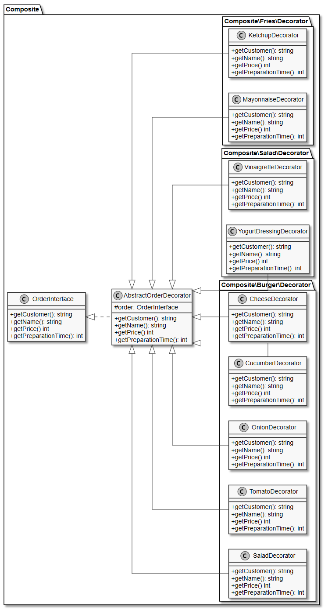
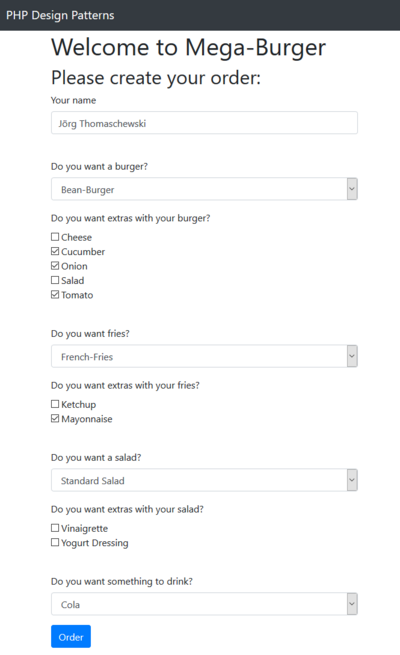
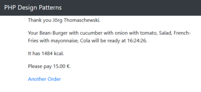

# 8.6 Composite Pattern (dt. Kompositum)

Das **Composite Pattern (dt. Kompositum)** ist ein **Strukturmuster** und wird verwendet, wenn Strukturen benötigt werden, die zusammensetzbar sind und bei denen die Schnittstelle in beiden Fällen die gleiche bleiben soll. Die entstehenden Baumstrukturen werden von einem Klienten genauso angesprochen wie eine Teilkomponente.

**Veränderte Anforderungen**<br>
Das Restaurant erlaubt ab sofort auch die Bestellung von Beilagen und Getränken. Jede dieser Dinge sowie auch die Burger können in beliebigen Kombinationen bestellt werden. Es gibt als Beilagen einen Salat für 2,50 Euro oder Pommes Frites für 3,00 Euro. Den Salat kann man mit Joghurtdressing oder einer Vinaigrette für jeweils 0,50 Euro bekommen. Zu den Pommes kann man Ketchup oder Mayonnaise für jeweils 0,50 Euro bekommen. Die Getränke sind Cola für 2,50 Euro oder Limonade für 2 Euro.

**Der überarbeitete Entwurf der Software**<br>  
Bei der Menge an Möglichkeiten für Beilagen und Getränke wird natürlich auch unser Klassendiagramm umfangreich. Aber wir haben bereits im Unterkapitel [Decorator Pattern (dt. Dekorierer)](./8.4DecoratorPattern.md)) das Interface **OrderInterface** und die abstrakte Klasse **AbstractOrderDecorator** für den Decorator kennengelernt. Auf dieser Grundlage lassen sich nun auch "Dekorationen" für die Pommes Frites und den Salat erstellen.

**Der schon bekannte Decorator mit weiteren Klassen**<br>



Auf der rechten Seite des ursprünglichen Klassendiagramms haben wir die eigentlichen Burger dargestellt, die über das **OrderTemplate** mit dem **OrderInterface** verbunden sind. Diesen Bereich des Klassendiagramms haben wir ja im letzten Kapitel [Strategy Pattern (dt. Strategie)](./8.5StrategyPattern.md) noch weiter "verfeinert". Dieser rechte Teil hat nun zusätzlich zu der Klasse **BurgerOrder** (mit seinen nicht eingezeichneten Klassen aus dem Unterkapitel [Strategy Pattern (dt. Strategie)](./8.5StrategyPattern.md) die weiteren Klassen für "FrenchFries", "Salat", "Cola" und "Lemonade". 

Damit diese Bestellungen sich nun zusammenführen lassen erstellen, wir noch eine neue Klasse **MainOrder**, die nun die zentrale Rolle für das Composite Pattern spielt. Diese Klasse **MainOrder** kann wiederum andere Bestellungen aufnehmen, also Klassen die *OrderInterface* implementieren. Damit lässt sich nun theoretisch auch eine Bestellung für eine Gruppe von Leuten implementieren, da auch verschiedene Hauptbestellungen wieder zusammengefasst werden können.


Hier beispielhaft die Klasse **ColaOrder**, die keinerlei "Überraschungen" enthält und aussieht, wie unsere ursprüngliche Klasse *BeefBurgerOrder* aus dem Unterkapitel [Template Pattern (dt. Schablone)](./8.3TemplatePattern.md). Die Klassen **SaladOrder** und **FrenchFriesOrder** haben dieselbe Struktur.

```php linenums="1"
?php declare(strict_types = 1);
/**
 * Represents an order of a cola.
 * @author Thorsten 'stepo' Hallwas
 */

class ColaOrder extends OrderTemplate
{
    public function getName(): string
    {
        return 'Cola';
    }

    public function getPrice(): int
    {
        return 250;
    }

    public function getPreparationTime(): int
    {
        return 5;
    }

    public function getKiloCalories(): int
    {
        return 300;
    }
}
```

??? example "Zum Vergleich der bisherige Sourcecode BeefBurgerOrder (aufklappen)"
    ```php linenums="1"
    <?php declare(strict_types = 1);
    /**
     * Representation of a beef-burger order in a burger restaurant.
     * @author Thorsten 'stepo' Hallwas
     */

    class BeefBurgerOrder extends OrderTemplate
    {

        public function getName(): string
        {
            return 'Beef-Burger';
        }

        public function getPrice(): int
        {
            return 850;
        }

        public function getPreparationTime(): int
        {
            return 300;
        }

        public function getKiloCalories(): int
        {
            return 550;
        }
    }
    ```


Für das Composite Pattern ist, wie schon oben geschrieben, die Klasse **MainOrder** neu und wichtig. Hier werden in der **Zeile 10** alle einzelnen Bestellungen in der Eigenschaft **`$orders[]`** in einem Array zusammengefügt. Daher hat das Pattern seinen Namen "Composite".

```php linenums="1"
<?php declare(strict_types = 1);
/**
 * Represents a main order in a restaurant.
 * @author Thorsten 'stepo' Hallwas
 */

class MainOrder extends OrderTemplate
{

    protected $orders = [];

    public function __construct(string $customer, $orders)
    {
        parent::__construct($customer);
        $this->orders = $orders;
    }

    public function getName(): string
    {
        $names = [];
        foreach ($this->orders as $order) {
            $names[] = $order->getName();
        }

        return implode(', ', $names);
    }

    public function getPrice(): int
    {
        $price = 0;
        foreach ($this->orders as $order) {
            $price += $order->getPrice();
        }

        return $price;
    }

    public function getPreparationTime(): int
    {
        $preparationTime = 0;
        foreach ($this->orders as $order) {
            $preparationTime += $order->getPreparationTime();
        }

        return $preparationTime;
    }

    public function getKiloCalories(): int
    {
        $kiloCalories = 0;
        foreach ($this->orders as $order) {
            $kiloCalories += $order->getKiloCalories();
        }

        return $kiloCalories;
    }
}
```


### Anpassung des Hauptprogramms
Unsere bisherige **createOrder** Funktion wird nun in **createBurgerOrder** umbenannt und nach dem gleichen Beispiel erstellen wir nun die Funktionen für die Pommes, die Getränke und den Salat. In diesem Beispiel für den Salat sehen Sie, wie der Code auf potenzielle Anpassungen für verschiedene Salate vorbereitet wurde, ohne dass viel mehr Code erzeugt werden musste.

```php linenums="1"
function createSaladOrder(string $customer, string $salad, ?array $saladExtras): OrderInterface 
{
    switch ($salad) {
        default:
            $saladOrder = new SaladOrder($customer);
    }

    if (is_array($saladExtras)) {
        foreach ($saladExtras as $saladExtra) {
            $saladOrder = addExtraToSaladOrder($saladExtra, $saladOrder);
        }
    }

    return $saladOrder;
}

function addExtraToSaladOrder(string $extraIdentifier, OrderInterface $order): OrderInterface 
{
    switch ($extraIdentifier) {
        case 'vinaigrette':
            return new VinaigretteDecorator($order);
        case 'yogurt':
            return new YogurtDressingDecorator($order);
    }

    return $order;
}
```


Nun fügen wir eine neue Funktion **createOrder** hinzu, welche die Hauptbestellung erzeugt und die Teilbestellungen aufnimmt.
```php linenums="1"
function createOrder(string $customer, ?string $burger, ?array $burgerExtras, ?string $fries,
                    ?array $friesExtras, ?string $salad, ?array $saladExtras, ?string $drink): OrderInterface 
{
    $orders = [];

    if (is_string($burger)) {
        $orders[] = createBurgerOrder($customer, $burger, $burgerExtras);
    }

    if (is_string($salad)) {
        $orders[] = createSaladOrder($customer, $salad, $saladExtras);
    }

    if (is_string($fries)) {
        $orders[] = createFriesOrder($customer, $fries, $friesExtras);
    }

    if (is_string($drink)) {
        $orders[] = createDrinkOrder($customer, $drink);
    }

    return new MainOrder($customer, $orders);
}
```

!!! question "Aufgabe"
    Laden Sie nun den Sourcecode herunter und bringen Sie das Formular auf Ihrem Server zum Laufen ([Sourcecode 9-6BurgerRestaurant.zip](./media/9-6BurgerRestaurant.zip)).

    Screenshot der Formularseite:  
    

    Screenshot der Ergebnisseite:  
    


!!! question "Aufgabe"
    Fügen Sie noch zwei weitere Extras für den Burger hinzu, sowie zwei Getränke. Zählen Sie währenddessen, wie viele Zeilen Sie anpassen/ergänzen müssen und in welchen Dateien sich diese Zeilen befinden. 