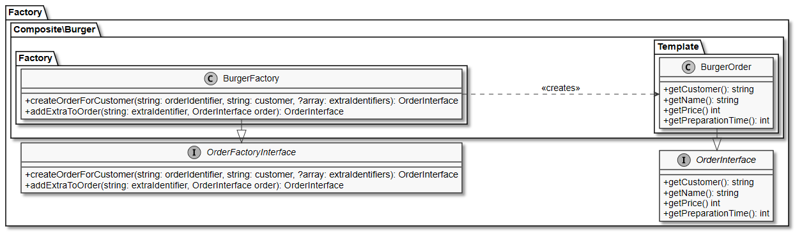
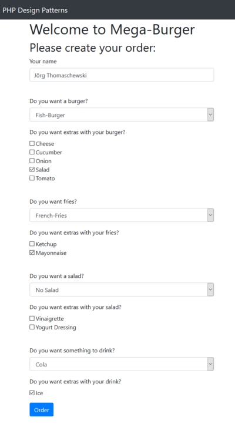
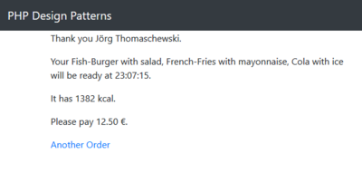

# 8.7 Factory Pattern (dt. Fabrik)

Das **Factory Pattern (dt. Fabrik)** oder auch Abstract Factory Pattern genannt, erzeugt verwandte Klassen zur Laufzeit und gehört damit zur Gruppe **Erzeugungsmuster**. 

Unser **Hauptprogramm** ist unübersichtlich geworden. Das Hinzufügen von neuen Zutaten wird den Code weiter wachsen lassen. Die im letzten Kapitel eingeführten neuen Bestellmöglichkeiten haben wir gelöst, indem wir für jede (Teil-)Bestellung eine Funktion geschrieben haben, die mit *create* (erzeuge) beginnt. Dieses ist ein guter Hinweis dafür, dass ein Erzeugungsmuster eingesetzt werden könnte. Wir verändern in diesem Kapitel den Code nicht aufgrund der Veränderungen der Anforderungen, sondern, weil wir das Hauptprogramm besser strukturieren und damit wartbarer gestalten sollten.

**Veränderte Anforderungen**<br>
Wir wollen für unsere Getränke noch Eis anbieten. Natürlich kostenlos.


**Der überarbeitete Entwurf der Software**  
Wir beginnen mit der Analyse des Hauptprogramms. Hier finden wir die sehr ähnlichen Funktionen **createBurgerOrder**, **createDrinkOrder**, **createFriesOrder** und **createSaladOrder**.

??? example "Hier das Beispiel für die Funktion createBurgerOrder (aufklappen)"
    ```php linenums="1"
    <?php
    function createBurgerOrder(string $customer, string $burger, ?array $burgerExtras): OrderInterface 
    {
        switch ($burger) {
            case 'bean':
                $patty = new BeanBurgerPattyStrategy();
                break;
            case 'beef':
                $patty = new BeefBurgerPattyStrategy();
                break;
            case 'chicken':
                $patty = new ChickenBurgerPattyStrategy();
                break;
            case 'fish':
                $patty = new FishBurgerPattyStrategy();
                break;
            default:
                $patty = new SeitanBurgerPattyStrategy();
        }
        $order = new BurgerOrder($customer, $patty);
        if (is_array($burgerExtras)) {
            foreach ($burgerExtras as $burgerExtra) {
                $order = addExtraToBurgerOrder($burgerExtra, $order);
            }
        }
        return $order;
    }
    ```


Ebenso finden wir für die Extras die Funktionen **addExtraToBurgerOrder**, **addExtraToFriesOrder** und **addExtraToSaladOrder**. 

??? example "Hier das Beispiel für die Funktion addExtraToBurgerOrder (aufklappen)"
    ```php linenums="1"
    <?php
    function addExtraToBurgerOrder(string $extraIdentifier, OrderInterface $order): OrderInterface {
        switch ($extraIdentifier) {
            case 'cheese':
                return new CheeseDecorator($order);
            case 'cucumber':
                return new CucumberDecorator($order);
            case 'onion':
                return new OnionDecorator($order);
            case 'salad':
                return new SaladDecorator($order);
            case 'tomato':
                return new TomatoDecorator($order);
        }

        return $order;
    }
    ```

Falls das Burger-Restaurant demnächst auch Pizza, Döner und andere Speisen anbietet, dann entsteht sehr viel, sehr ähnlicher Sourcecode und dies ist wie immer zu vermeiden. Das interessante an dem Sourcecode in den Funktionen ist, dass in diesen Funktionen mit *new* je nach Bedarf entsprechende Objekte erzeugt werden. Dies ist ein klarer Fall für das Factory Pattern.

Das Klassendiagramm ist hier zur Vollständigkeit angegeben, aber besser schauen wir uns diesmal den Sourcecode direkt an.

**Factory Pattern zur Erzeugung der wiederkehrenden Funktionen im Hauptprogramm**<br>


Wir erstellen nun das Interface **OrderFactoryInterface**. Dieses Interface ist sehr generell und muss nicht einmal angepasst werden, falls unser Burger-Restaurant zukünftig auch Pizza anbietet.

```php linenums="1"
<?php
interface OrderFactoryInterface
{
    public function createOrderForCustomer(
        string $orderIdentifier, 
        string $customer, 
        ?array $extraIdentifiers
    ): OrderInterface;

    public function addExtraToOrder(
        string $extraIdentifier, 
        OrderInterface $order
    ): OrderInterface;
}
```

Wie immer definiert auch dieses Interface nur die Methoden (hier: **createOrderForCustomer** und **addExtraToOrder**), die in der konkreten Implementation zu verwenden sind.

Die erste konkrete Implementation dieses Interfaces ist die **BurgerFactory**.

```php linenums="1"
<?php declare(strict_types = 1);
/**
* Factory to create an order of a burger.
* @author Thorsten 'stepo' Hallwas
*/

class BurgerFactory implements OrderFactoryInterface
{
    public function createOrderForCustomer(
        string $orderIdentifier,
        string $customer,
        ?array $extraIdentifiers
    ): OrderInterface {
        switch ($orderIdentifier) {
            case 'bean':
                $patty = new BeanBurgerPattyStrategy();
                break;
            case 'beef':
                $patty = new BeefBurgerPattyStrategy();
                break;
            case 'chicken':
                $patty = new ChickenBurgerPattyStrategy();
                break;
            case 'fish':
                $patty = new FishBurgerPattyStrategy();
                break;
            default:
                $patty = new SeitanBurgerPattyStrategy();
        }
        $order = new BurgerOrder($customer, $patty);
        if (is_array($extraIdentifiers)) {
            foreach ($extraIdentifiers as $extraIdentifier) {
                $order = $this->addExtraToOrder($extraIdentifier, $order);
            }
        }
        return $order;
    }

    public function addExtraToOrder(
        string $extraIdentifier,
        OrderInterface $order
    ): OrderInterface {
        switch ($extraIdentifier) {
            case 'cheese':
                return new CheeseDecorator($order);
            case 'cucumber':
                return new CucumberDecorator($order);
            case 'onion':
                return new OnionDecorator($order);
            case 'salad':
                return new SaladDecorator($order);
            case 'tomato':
                return new TomatoDecorator($order);
            default:
                return $order;
        }
    }
}
```

Damit haben wir das Erzeugen der Objekte aus dem Hauptprogramm ausgelagert in beiden Methoden der Klasse **BurgerFactory** und unser Hauptprogramm ist deutlich schlanker geworden. Analog implementieren wir die anderen Factories für die Pommes, die Getränke und den Salat.

## Anpassung des Hauptprogramms
Wir entfernen die Funktionen zur Erstellung der Bestellungen außer der Hauptbestellung und ersetzen diese mit Aufrufen der Methoden der Factories.

```php linenums="1"
<?php
function createOrder(string $customer, ?string $burger, ?array $burgerExtras, ?string $fries,
                    ?array $friesExtras, ?string $salad, ?array $saladExtras, ?string $drink,
                    ?array $drinkExtras
                    ): OrderInterface 
{
    $burgerFactory = new BurgerFactory();
    $friesFactory = new FriesFactory();
    $saladFactory = new SaladFactory();
    $drinkFactory = new DrinkFactory();

    $orders = [];
    if (is_string($burger)) {
        $orders[] = $burgerFactory->createOrderForCustomer($burger, $customer, $burgerExtras);
    }
    if (is_string($salad)) {
        $orders[] = $saladFactory->createOrderForCustomer($salad, $customer, $saladExtras);
    }
    if (is_string($fries)) {
        $orders[] = $friesFactory->createOrderForCustomer($fries, $customer, $friesExtras);
    }
    if (is_string($drink)) {
        $orders[] = $drinkFactory->createOrderForCustomer($drink, $customer, $drinkExtras);
    }

    return new MainOrder($customer, $orders);
}
```

!!! question "Aufgabe"
    Laden Sie nun den Sourcecode herunter und bringen Sie das Formular auf Ihrem Server zum Laufen ([Sourcecode 9-7BurgerRestaurant.zip](./media/9-7BurgerRestaurant.zip)).

    Screenshot der Formularseite:  
    

    Screenshot der Ergebnisseite:  
    


!!! question "Übung Profifrage"
    Welche Vorteile ergeben sich durch die Sichtbarkeit **public** der Methode **addExtraToOrder**? 

??? example "Lösung"
    Es erlaubt die spätere Veränderung des Objektes und theoretisch lassen sich auch Sonderwünsche umsetzen, Beispielsweise Pommes mit Zwiebeln.