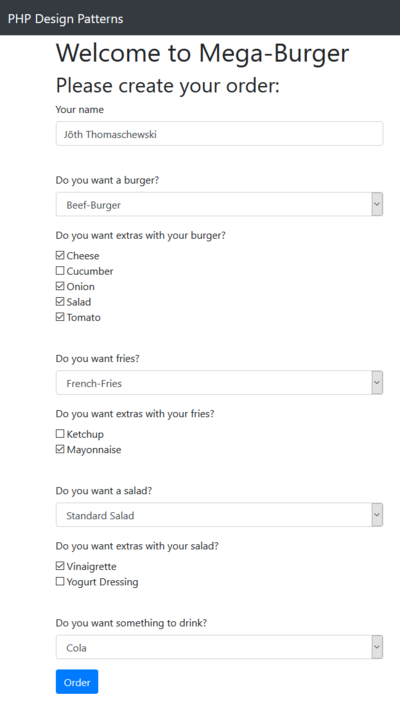
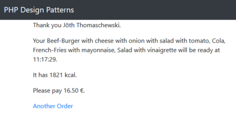

# 8.8 Builder Pattern (dt. Erbauer)

Unser letztes Muster **Builder Pattern (dt. Erbauer)** ist ebenfalls ein **Erzeugungsmuster**. Das **Builder Pattern** besteht aus zwei Teilen: Dem konkreten Builder, der ein komplexes Konstrukt aus Objekten zusammensetzen kann, sowie dem (optionalen) Director, der den Builder steuert.


**Veränderte Anforderungen**<br>
Wir haben mit der Erweiterung der Bestellungen viele Kombinationen erzeugt und wollen den Kunden auch die Möglichkeit bieten, ein Menü zu wählen und dieses günstiger zu bekommen.

**Menüs**

- Burger, Salat und Pommes Menü (Rabatt 1,50 €)
    - Ein Burger nach Wahl
    - Salat
    - Pommes mit Ketchup oder Mayonnaise
    - Eine Cola oder Limonade
- Burger und Pommes Menü (Rabatt 1,00 €)
    - Ein Burger nach Wahl
    - Pommes mit Ketchup oder Mayonnaise
    - Eine Cola oder Limonade
- Salat und Pommes Menü (Rabatt 1,00 €)
    - Salat
    - Pommes mit Ketchup oder Mayonnaise
    - Eine Cola oder Limonade
- Pommes Menü (Rabatt 0,50 €)
    - Pommes mit Ketchup oder Mayonnaise
    - Eine Cola oder Limonade


**Der überarbeitete Entwurf der Software**  
Im Unterkapitel **[Composite Pattern (dt. Kompositum)](./8.6CompositePattern.md)** haben wir bereits die Klasse **MainOrder** erstellt, die Teilbestellungen aufnehmen kann. Im Unterkapitel **[Factory](./8.7FactoryPattern.md)** haben wir für alle Bestellungsmöglichkeiten spezielle Fabriken angelegt, die uns die Erstellung der Objekte vereinfachen.

Wir benötigen nun noch zwei Dinge:

- Die Bestellungen müssen zu einem Menü zusammenfassbar sein. Hierzu erstellen wir die Klassen **MenuBuilderInterface**, **MenuBuilder** und **MenuDirector**.
- Die Berechnung des Rabatts für ein Menü macht ein **DiscountDecorator**.

### MenuBuilderInterface und MenuBuilder
Das **MenuBuilderInterface** definiert wie immer die notwendigen Methoden, die im **MenuBuilder** programmiert werden müssen. 

**MenuBuilderInterface**
```php linenums="1"
<?php declare(strict_types = 1);
/**
 * Interface for menu builders.
 */

interface MenuBuilderInterface
{
    public function getMenu(): OrderInterface;
    public function setBurger(OrderInterface $burger): void;
    public function setSalad(OrderInterface $salad): void;
    public function setFries(OrderInterface $fries): void;
    public function setDrink(OrderInterface $drink): void;
}
```

**MenuBuilder**
```php linenums="1"
<?php declare(strict_types = 1);
/**
 * Builds a menu with the given orders.
 */

class MenuBuilder implements MenuBuilderInterface
{
    protected $burger;
    protected $drink;
    protected $fries;
    protected $salad;
    protected $customer;

    public function __construct(string $customer)
    {
        $this->customer = $customer;
    }

    public function getMenu(): OrderInterface
    {
        $menu = new MainOrder($this->customer, $this->getOrders());
        return new DiscountDecorator($menu, $this->getDiscount());
    }

     protected function getOrders(): array
    {
        $orders = [];
        if ($this->burger) {
            $orders[]= $this->burger;
        }
        if ($this->drink) {
            $orders[] = $this->drink;
        }
        if ($this->fries) {
            $orders[] = $this->fries;
        }
        if ($this->salad) {
            $orders[] = $this->salad;
        }

        return $orders;
    }

    protected function getDiscount(): int
    {
        $discount = 0;
        if ($this->drink instanceof OrderInterface) {
            if ($this->fries instanceof OrderInterface) {
                $discount += 50;
            }
            if  ($this->salad instanceof OrderInterface) {
                $discount += 50;
            }
            if ($this->burger instanceof OrderInterface) {
                $discount += 50;
            }
        }

        return $discount;
    }

    public function setBurger(OrderInterface $burger): void
    {
        $this->burger = $burger;
    }

    public function setDrink(OrderInterface $drink): void
    {
        $this->drink = $drink;
    }

    public function setFries(OrderInterface $fries): void
    {
        $this->fries = $fries;
    }

    public function setSalad(OrderInterface $salad): void
    {
        $this->salad = $salad;
    }
}
```

**MenuDirector** steuert die Factories und erstellt das Menü.
```php linenums="1"
<?php declare(strict_types = 1);
/**
 * Directs the creation of a menu.
 */

class MenuDirector
{
    protected $burgerFactory;
    protected $drinkFactory;
    protected $friesFactory;
    protected $saladFactory;
    protected $menuBuilder;


    public function __construct(
        BurgerFactory $burgerFactory,
        DrinkFactory $drinkFactory,
        FriesFactory $friesFactory,
        SaladFactory $saladFactory,
        MenuBuilderInterface $menuBuilder
    ) {
        $this->burgerFactory = $burgerFactory;
        $this->drinkFactory = $drinkFactory;
        $this->friesFactory = $friesFactory;
        $this->saladFactory = $saladFactory;
        $this->menuBuilder = $menuBuilder;
    }


    public function createOrder(
        string $customer,
        ?string $burger,
        ?array $burgerExtras,
        ?string $fries,
        ?array $friesExtras,
        ?string $salad,
        ?array $saladExtras,
        ?string $drink,
        ?array $drinkExtras
    ): OrderInterface {
        if (is_string($burger)) {
            $this->menuBuilder->setBurger(
                $this->burgerFactory->createOrderForCustomer(
                    $burger, $customer, $burgerExtras
                )
            );
        }

        if (is_string($drink)) {
            $this->menuBuilder->setDrink(
                $this->drinkFactory->createOrderForCustomer(
                    $drink, $customer, $drinkExtras
                )
            );
        }

        if (is_string($fries)) {
            $this->menuBuilder->setFries(
                $this->friesFactory->createOrderForCustomer(
                    $fries, $customer, $friesExtras
                )
            );
        }

        if (is_string($salad)) {
            $this->menuBuilder->setSalad(
                $this->saladFactory->createOrderForCustomer(
                    $salad, $customer, $saladExtras
                )
            );
        }

        return $this->menuBuilder->getMenu();
    }

}
```


Die Decorator-Klassen erhöhen ja bislang immer auch den Preis je Zutat für die Produkte. Nun brauchen wir einen entsprechenden **DiscountDecorator**, um den Rabatt zu geben. 

```php linenums="1"
<?php declare(strict_types = 1);
/**
 * Substrats the given discount from the order.
 */

class DiscountDecorator extends AbstractOrderDecorator
{
    protected $discount;

    public function __construct(OrderInterface $order, int $discount)
    {
        parent::__construct($order);
        $this->discount = $discount;
    }

    public function getPrice(): int
    {
        return parent::getPrice() - $this->discount;
    }
}
```


### Anpassung des Hauptprogramms
Wir können nun die Funktion **createOrder** ersetzen mit der Methode der Instanz der Klasse **MenuDirector**. Wir reichen alle Fabriken sowie den **MenuBuilder** über den Konstruktor hinein.

```php linenums="1"
<?php
if ($customer && ($burger || $fries || $salad || $drink)) {
    $menuDirector = new MenuDirector(
        new BurgerFactory(),
        new DrinkFactory(),
        new FriesFactory(),
        new SaladFactory(),
        new MenuBuilder($customer)
    );

    $order = $menuDirector->createOrder(
        $customer,
        $burger,
        $burgerExtras,
        $fries,
        $friesExtras,
        $salad,
        $saladExtras,
        $drink,
        $drinkExtras
    );

    printOrderSummary($order);
} else {
    printOrderForm();
}
```

Der Aufruf von **createOrder** gibt uns wieder eine Instanz von OrderInterface zurück, sodass der Rest unseres Hauptprogramms noch genauso weiter funktioniert.


!!! question "Aufgabe"
    Laden Sie nun die Sourcecode herunter und bringen Sie das Formular auf ihrem Server zum Laufen (Sourcecode [9-8BurgerRestaurant.zip](./media/9-8BurgerRestaurant.zip)).

    Screenshot der Formularseite (genau wie im letzten Unterkapitel):  
    

    Screenshot der Ergebnisseite (genau wie im letzten Unterkapitel, jedoch wird beim Preis der Rabatt abgezogen).
    


!!! question "Einfache Aufgabe"
    Wir haben im Hauptprogramm noch immer ein Funktion **printOrderForm**, der einen "unschönen" Block aus HTML enthält. Lagern Sie diesen HTML-Code in eine Datei aus, die in das Verzeichnis **0-framework** gelegt werden soll.


!!! question "Wichtige Aufgabe"
    Wir haben hier jetzt kein Klassendiagramm gezeigt. 
    - Erstellen Sie zunächst ein Klassendiagramm für die vier neuen Klassen **MenuBuilderInterface**, **MenuBuilder**, **MenuDirector** und **DiscountDecorator**.
    - Schauen Sie, wie diese Klassen im Gesamtklassendiagramm verbunden sind.
    - Wer möchte, kann das gesamte Klassendiagramm aufzeichnen. Wir haben (ohne die Klassen in den Ordnern **0-framework** und **vendor**) insgesamt 35 Klassen erstellt! 


!!! tip "Hinweis"
    Nicht nur der gesamte Sourcecode ist nun schon recht umfangreich geworden, sondern auch die Erklärungen haben sich immer mehr dem professionellen Wording angepasst. Wenn Sie die Beispiele bis hier hin erfolgreich nachvollzogen und die Aufgaben gewissenhaft bearbeitet haben, dann sind Sie auf einem sehr guten Weg zur professionellen Programmierung. Sollte es Ihnen nicht gelungen sein alles nachzuvollziehen, dann sollten Sie die Stelle überlegen, an der Sie "ausgestiegen" sind. Beginnen Sie ab dort erneut und bitte Sie um Hilfe bei Betreuungsteam oder den Kommilitonen.
